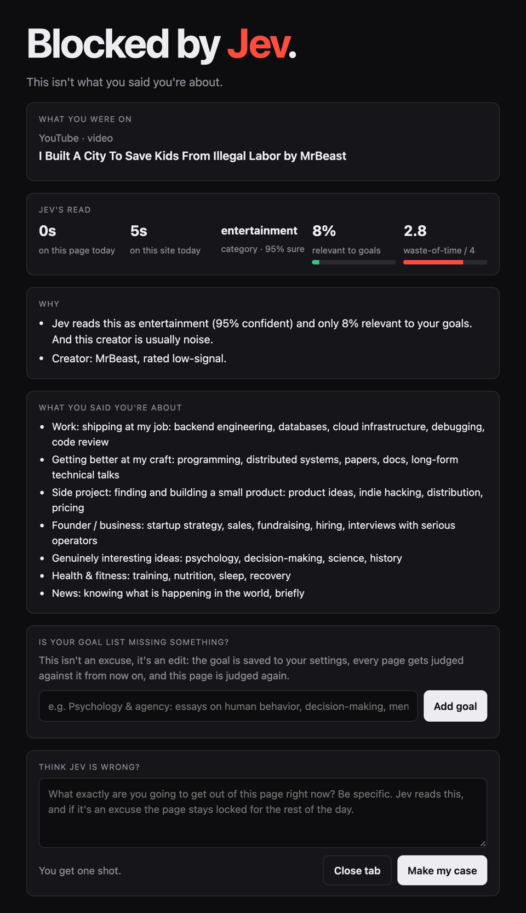

# Rot Guard

A Chrome extension that blocks content, not sites. It reads the video, post or article you're on and asks [TypeSafe Jev](https://docs.typesafe.ai) if it serves your goals. If it doesn't, it's gone.



## What it does

- **YouTube:** judges each video. Useful ones play, junk gets blocked. Irrelevant tiles in feeds and search collapse. Shorts are always hidden.
- **X:** judges each post. Irrelevant posts collapse to one line. Ads are always hidden. 2 check-ins a day, 15 minutes each.
- **Everything else:** Reddit, LinkedIn, articles and any other page get judged too.
- **Time:** the longer you stay, the stricter it gets.
- **Appeals:** one shot. Give a specific reason and you get 15 minutes. Give an excuse and you get "Fuck you." and a lock until midnight.
- **Fun and music:** your hobbies are never blocked on content. Music is never blocked.


## Setup

Needs Chrome, Node 18+ and a [TypeSafe Jev](https://docs.typesafe.ai) API key.

```sh
git clone https://github.com/plusminushalf/rot-guard.git
cd rot-guard
cp .env.example .env                                            # add your JEV_API_KEY
node scripts/build-config.mjs                                   # writes extension/config.local.json
cp extension/profile.example.json extension/profile.local.json  # edit it
```

Open `chrome://extensions`, turn on **Developer mode**, click **Load unpacked**, pick `extension/`.

Or skip the files and set the key and profile in the extension's **Settings**.

## Your profile

Lives in `extension/profile.local.json` (gitignored). Without it, `profile.example.json` is used.

| Key | Meaning |
| --- | --- |
| `profile` | Who you are, in a few sentences. |
| `goals` | What counts as progress. Be specific: "Postgres internals" beats "work". |
| `fun` | Hobbies. Only time limits apply. |
| `avoid` | What counts as rot for you. |
| `allowlist` | Domains that are never judged. Subdomains included. |
| `trustedCreators` / `mutedCreators` | Always shown / always hidden. |

Any key from `DEFAULT_SETTINGS` in `extension/shared.js` works here too (`passMinutes`, `xCheckinsPerDay`, `readingMinutesPerDay`, …). Settings saved in the extension override the file. Changing goals clears the cache.

## How it decides

- **Extraction:** readers for YouTube, X, Reddit and LinkedIn, plus a generic one for everything else.
- **Jev answers typed questions:** category, relevant to goals (yes/no), waste-of-time score (0–4), and whether it's a feed.
- **Rules are code:** Jev is bad at numbers. Thresholds tighten at 2, 10 and 20 minutes. Shorts and rot are blocked instantly. Feeds are blocked after 10 minutes, and any site that doesn't serve your goals after 60 minutes a day.
- **Time is engaged time only:** the tab has to be visible, and either focused and active or playing media. Reloading doesn't reset it.
- **Per item:** X posts and YouTube tiles are judged one by one, 10 per request. Feed pages themselves are only blocked on time.
- **Creator reputation:** every author or channel gets rated high, neutral or low signal. The rating comes from Jev's opinion (only when it's confident) and your track record with them (after 3 items). It shifts relevance by ±0.25, so experts' sarcasm passes and noise accounts' polished takes don't.
- **Articles:** judged on their beginning, middle and end, because essays often bury the point.
- **Cache:** answers are cached for 1 day by content hash. Nothing gets judged twice.
- **Budgets:** X gets 2 check-ins of 15 minutes, and a new check-in starts after 45 minutes away. Newsletters get 45 minutes a day.
- **Missing goal?** Add it from the block page. The page is judged again.

## Privacy

There's no server. Page titles, post text, video titles, channel names, article excerpts and your profile go to the Jev API. Everything else stays in the browser. Allowlisted domains are never sent.

## Layout

```
extension/
  background.js   time, budgets, locks, cache
  content.js      per-site extraction, blurring, collapsing
  jev.js          Jev client + decision rules
  cache.js        verdict cache
  shared.js       settings + helpers
  popup.* options.* blocked.*   extension pages
scripts/          build-config.mjs: .env → config.local.json
test/             live tests against Jev
```

## Tests

These hit the live Jev API with the example profile. They need `JEV_API_KEY` in your env or `config.local.json`.

```sh
node test/jev-live.mjs        # pages + appeals
node test/x-posts-live.mjs    # X posts
node test/yt-videos-live.mjs  # YouTube videos
node test/creators-live.mjs   # creator reputation
node test/profile-live.mjs    # fun, music, interests
```

Jev is probabilistic. Cases near a threshold can flip.

## How this was built

Most of the code, tests and docs were written by an AI coding agent (Claude Code), directed by me.

## License

[MIT](LICENSE)
